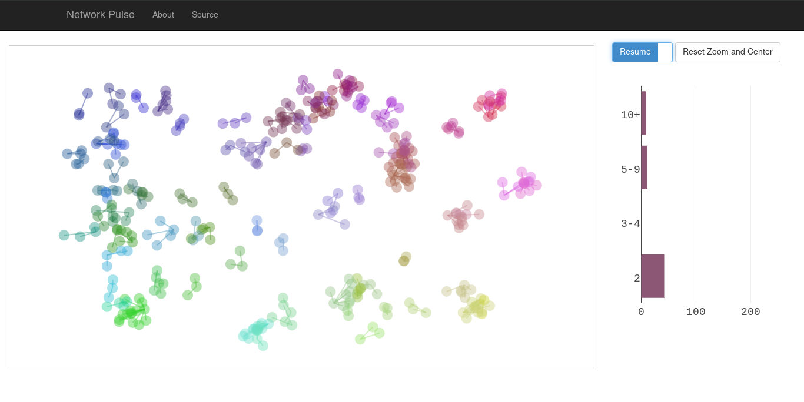
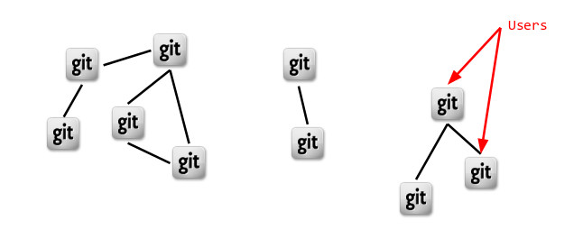
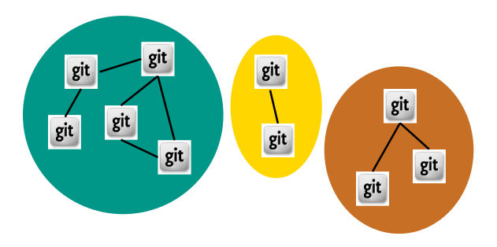
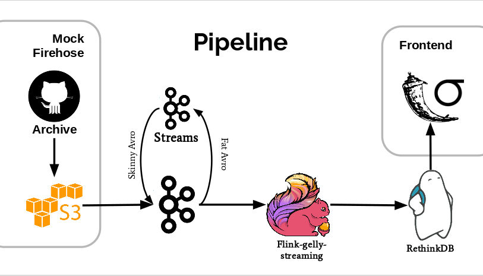
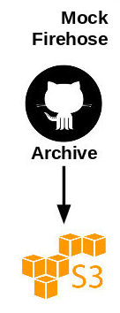
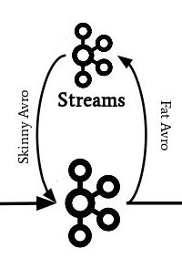
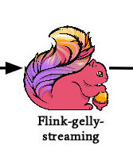
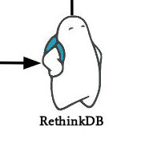
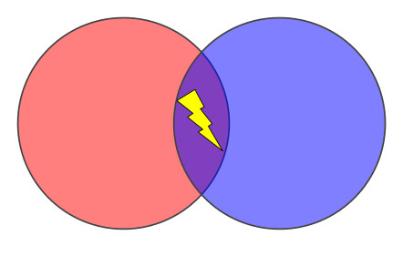

# !! PET PROJECT ALERT !!

Welcome! Thank you for your interest! This was a small project I worked on for about 3 weeks in the Fall of 2016. It is a hacked-together prototype, kept alive on my github account so I can look back and remember that one time I did a thing.

I do not recommend you build off this work (or even look at it that closely).

# Network Pulse

## tl;dr

 * [Slides][slides]
 * [Live Demo][demo]
 * ~~5 Minute Video Presentation~~
 * ~~Demo Video~~

## Index

1. [Introduction](README.md#1-introduction)
 * 1.1 [Project Details](README.md#11-project-details)
2. [The Pipeline](README.md#2-the-pipeline)
 * 2.0 [Avro Schema](README.md#20-avro-schema)
 * 2.1 [Mock Firehose](README.md#21-mock-firehose)
 * 2.2 [Venturi](README.md#22-venturi)
 * 2.3 [Flink Connected Components](README.md#23-flink-connected-components)
 * 2.4 [UI Server](README.md#24-ui-server)
 * 2.5 [RethinkDB Persistence from Flink](README.md#25-rethinkdb-persistence-from-flink)
3. [Performance](README.md#3-performance)
4. [Future Work](README.md#4-future-work)
5. [Deployment](README.md#5-deployment)

## 1. Introduction

Think: Facebook and Linkedin. These are giant networks of people,
growing by the second, and they play a key role in many of our
lives. If you want to do something interesting with the data that
drives these networks, until recently, you'd have to gather all the
years of data and process it over hours, or days.

**Network Pulse is a distributed, fault-tolerant big data pipeline
that performs graph analysis over unbounded data streams.** *It's
streaming graph analysis at the pace of change.* The goal is to find
and outline clusters of people interacting with each other, as the
interactions happen.

 * With this information, we could find who the most influential people
are *as they develop their influence*.
 * We could recommend new connections *when the connections are most
relevant*.
 * We could predict who would most easily bridge two separated groups,
and use that information to strengthen a community *when momentum is
at its peak*.

Network Pulse is a powerful prototype; the kind of technology that
will serve as a building block towards the realization of these
goals. I created Network Pulse in 3 weeks as part of the [Insight Data
Engineering Fellowship Program][InsightDE].

### 1.1 Project Details

The [Network Pulse demo][demo] is set up to operate over [GitHub's
Archive of Event data][gharchive]: roughly 1.2 Terabytes of github
event metadata, recorded from 2011 to 2015, encompassing 20+ GitHub
activities, from Commit Comments to Watch Events.

For the purposes of this graph analysis, GitHub users are represented
as nodes (or vertices) in the graph ...

... and any sort of event between two users is represented as an edge
between vertices.

The goal of this project is to find clusters of people as they
interact, directly and indirectly

## 2. The Pipeline

There are 5 independent sub-projects within the codebase, and one
additional project with cross-cutting concerns. Let's begin there.

### 2.0 Avro Schema

[Source](0.avro-schema)

There are two types of Avro schemas in play:

 * the schemas extracted from GitHub's Archive data, and
 * the trimmed-down version Network Pulse uses

The GitHub Archive schemas were extracted from the Avro source data;
there are two because of a schema change in 2015. I also designed a
trimmed-down version of the event data schema to provide the minimum
amount of information needed to accomplish the overarching goal.

Both schemas were used to generate the Java Objects that are used for
schema-specific serialization and deserialization of the event
byte-stream flowing through Kafka. More on that soon.

Many of the sub-projects rely on these schemas, so the relevant code
is broken out into its own sub-project, built as an independent jar,
and included via maven dependencies.

### 2.1 Mock Firehose

[Source](1.mock-firehose)

Since GitHub does not have a firehose I could use for this project, I
set about creating one of my own. I chose to maintain my source of
truth in Amazon S3, and dial up the throughput using multiple
independent EC2 nodes that stream from S3 into my Kafka ingestion
endpoint.

The initial setup was fairly tedious. The event data are provided
across 5 [Google BigQuery][ghbigquery] tables. I exported this data in
Avro format into google's cloud storage, which created just over 2000
Avro bundles at roughly ~600MB each (a limitation of BigQuery's export
feature). I then used Google's `gsutil` on a Google Cloud Compute
instance to rsync those Avro files to my Amazon S3 bucket. This
process took about 2 days.

With the data now available in S3, the last step was to create a
process that could stream this data from S3 to produce independent
messages into a Kafka topic. I did this in Java using the AWS SDK,
Kafka's java libraries, Avro's java libraries, and Twitter's
[bijection][bijection] tool for (de)serialization.

 
### 2.2 Venturi

[Source](2.venturi)

The data required for this clustering operation is significantly less
than the source data provides, so I created Venturi to serve as a
parsing and filtering layer in the pipeline.

The result is a Java process that acts as both a Kafka Consumer and
Producer:

 * ingesting the full GitHub Event record in Avro format from a Kafka topic,
 * deserializing it,
 * parsing out the relevant data (users, event-type, url, timestamp, etc.),
 * creating a new skinny avro record, and
 * producing a byte-stream-serialized version of it on a new Kafka topic.

About 55% of the data is filtered out in this process as well. The
primary reason is because many GitHub events are created by people
working on their own repos, and don't represent a connection between
distinct individuals. Events like these are filtered out for the
purposes of clustering users.

 
### 2.3 Flink Connected Components

[Source](3.flinkCC)

The engine of this pipeline is implemented in Flink using the
experimental [gelly-streaming][gelly-streaming] graph
library. [Flink][flink] is an open source Kappa-architecture-esque
tool primarily based on [Google's Dataflow Model][dataflow].

Gelly-streaming already had a rolling connected components example
using tumbling windows (incrementally updating global clusters in
parallel as new data streams in). [My contribution][gscontrib] was to
implement a global, non-rolling connected components algorithm over
sliding windows (finding global clusters in parallel with overlapping
windows to capture a sense of change, and discarding previous
results). The original intent here was to capture the current state of
the network, and use it as a context in which to evaluate large batch
computation results. But I now believe the tool is more generally
useful than that.

The beauty of the distributed connected components algorithm lies in
its ability to split the incoming data randomly and uniformly across
Flink nodes, which provides a great opportunity to scale this process
horizontally. There are two stream processing steps in this algorithm
at which a single node must process all the data flowing through, but
they are not bottlenecks at any scale I was able to test; much of the
heavy processing is done upstream and in parallel.

 
### 2.4 UI Server

[Source](4.ui-server)

The UI is built as a mobile-first [Bootstrap][bootstrap] web app, with
visualizations built in [Sigma.js][sigma] and [Plotly][plot.ly], and
server-push communications using [Socket.IO][socketio]
(javascript). This app is served by a Flask web server that uses
websocket broadcast messages via Socket.IO (python) to push new data
frames down to the browser clients. The Flask server recieves these
new data frames via a [RethinkDB changefeed][changefeed], with a
registered change listener that performs the previously-mentioned
broadcast.

 
### 2.5 RethinkDB Persistence from Flink

[Source](5.kafkaRethink)

I wanted to persist the windowed cluster data in a way that would
allow many clients to subscribe and view the stream of clusters in an
efficient way, currently at about 5 frames per
second. [RethinkDB][rethink] was designed well for this task. I
created a cluster of three RethinkDB nodes with three partitions and
two replications, to distribute the load, and provide some
durability. I also installed RethinkDB Proxies on my "kafkaRethink"
nodes (see below), which are designed to improve the cluster's overall
efficiency.

Unfortunately, I did not find a great way to connect Flink to
RethinkDB in a durable way, as Flink is still a fairly young product
and it seems relatively few people are using it with RethinkDB.

My solution was to use Kafka once again, this time as the ether
between Flink and Rethink for the windowed cluster data, and to create
yet another Kafka consumer, but one that uses RethinkDB's libraries to
persist the data. Kafka provides some durability here, but the
"kafkaRethink" process does not yet do well in network splits or node
crash scenarios. A more robust solution here would be a decent
investment.

 
## 3. Performance

At 20,000 events ingested per second, Network Pulse chugs along
without complaint. There are 9 servers in total:

 * 3x RethinkDB cluster, with 3 partitions and 2 replications each
 * 2x Producers, which operate the mock firehose
 * 4x Kafka / Flink nodes, the workhorses of the pipeline

Originally prototyped 100% multitenant, I opted to test the limits of
this system before separating technologies, and I was quite happy with
the performance. This fairly simple setup can process 10 years worth
of GitHub Event data in about 7 hours; roughly 2.5 Terabytes in 7
hours, or 8.5TB per day.

The primary downside to a multitenant setup (in the absence of
resource contention) is the overhead of a more complicated recovery
situation, but in the context of building this 3-week prototype, I
felt it was worth acknowledging that drawback and moving on to cover
the breadth of the problem.

The two most likely bottlenecks are venturi and flinkCC, since they
perform the most processing on the most data, and this task is
primarily CPU-bound. Both components are horizontally scalable
(via Kafka consumer groups and Flink parallelism, respectively). I've
been very impressed with both technologies, and I look forward to
watching (and helping) Flink mature.

## 4. Future Work

On its own, Network Pulse serves as a building block towards the
construction of powerful analytical tools. One concrete use case I'd
like to work on is implementing a [distributed Min-Cut/Max-Flow
algorithm][mcmf] in Gelly-Streaming. This would solve the first use
case outlined in the Introduction: finding influencers as they develop
their influence.

The second example given in the introduction -- recommending new
connections in a timely way -- would likely be solved with a batch
component that calculates the long history of everyone's interactions,
and a streaming pattern matching component to establish a sense of
timeliness and context in which to evaluate a recommendation
opportunity.

The third example -- community building via potential influencers --
would be solved with a combination of the previous examples, along
with an additional stream analysis component: determining the growth
or recession of connection activity within the relevant groups, to
determine the best time to suggest a joining connection.

 

## 5. Deployment

See the [DEPLOY][deploy] guide.

Much of the ops work on this project was done using the
[Pegasus][pegasus] deployment and management tool. If you'd like to
run your own Network Pulse cluster, the guide above walks you through
the initial setup.

[demo]: https://drfloob.com/pulse
[slides]: https://drfloob.com/pulse/slides
[InsightDE]: http://insightdataengineering.com/
[gharchive]: https://www.githubarchive.org/
[pegasus]: https://github.com/insightdatascience/pegasus
[deploy]: DEPLOY.md
[ghbigquery]: https://bigquery.cloud.google.com/table/githubarchive:year.2011?pli=1
[bijection]: https://github.com/twitter/bijection
[gelly-streaming]: https://github.com/vasia/gelly-streaming
[flink]: https://flink.apache.org/
[dataflow]: http://research.google.com/pubs/archive/43864.pdf
[gscontrib]: https://github.com/vasia/gelly-streaming/pull/26
[bootstrap]: https://getbootstrap.com/
[sigma]: http://sigmajs.org/
[plot.ly]: https://plot.ly/
[socketio]: http://socket.io/
[changefeed]: https://rethinkdb.com/docs/changefeeds/javascript/
[mcmf]: https://github.com/vasia/gelly-streaming/issues/28
[rethink]: https://rethinkdb.com/
