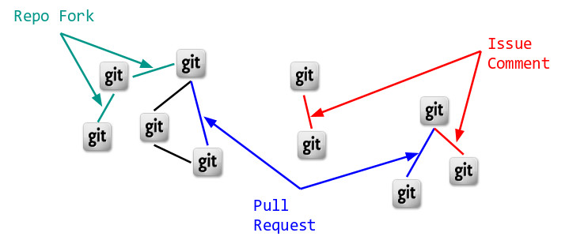

# [Network Pulse][demo]

## Index

1. [Introduction](README.md#1-introduction)
 * 1.1 [Details](README.md#11-details)
2. [The Pipeline](README.md#2-the-pipeline)
 * 2.0 [Avro Schema](README.md#20-avro-schema)
 * 2.1 [Mock Firehose](README.md#22-mock-firehose)
 * 2.2 [Venturi](README.md#23-venturi)
 * 2.3 [Flink Connected Components](README.md#24-flink-connected-components)
 * 2.4 [UI](README.md#26-ui)
 * 2.5 [RethinkDB](README.md#25-rethinkdb)
3. [Performance](README.md#3-performance)
4. [Future Work](README.md#4-future-work)
5. [Deployment](README.md#5-deployment)

## 1. Introduction

Think: Facebook and Linkedin. These are giant networks, growing by the
second, and they play a key role in many of our lives. It's been the
case that if you want to do something interesting on the data that
drives these networks, you have to round up all your Petabytes in one
go and process it all over hours, if not days!

**Network Pulse is a distributed, fault-tolerant big data pipeline
that performs graph analysis over unbounded data streams. Streaming
graph analysis at the pace of change.** Its goal is to find clusters
of people who interact with each other, as they interact.

With this information, we can find who the most influential people are
*as they develop their influence*.

We can recommend new connections *when the connections are most
relevant*.

We can predict who would most easily bridge two separate groups, and
use that information to strengthen a community *when momentum is at its
peak*.

Network Pulse is a powerful prototype; the kind of technology that
will serve as a building block towards the realization of these
goals. I created Network Pulse in 3 weeks as part of the [Insight Data
Engineering Fellowship Program][InsightDE].

### 1.1 Project Details

The Network Pulse demo is set up to operate over [GitHub's Archive of
Event data][gharchive]: roughly 1.2 Terabytes of github event
metadata, recorded from 2011 to 2015, encompassing 20+ GitHub
activities, from Commit Comments to Watch Events.

For the purposes of this graph analysis, GitHub users are represented
as nodes (or vertices) in the graph ...

... and any sort of event between to users is represented as an edge
between vertices.

For example, when User A submits a pull request to User B's repo, this
is translated to a PullRequestEvent in the GitHub data, and
represented as a connection between users A and B in Network Pulse's
graph.

About 55% of the data is filtered out post-ingestion. The primary
reason is because many GitHub events are created by people working on
their own repos, and don't represent a connection between distinct
individuals. Events like these are filtered out for the purposes of
clustering users.

## 2. The Pipeline

There are 5 independent sub-projects within the codebase, and one
additional project with cross-cutting concerns.

### 2.0 Avro Schema

There are two Avro schemas in play:

 * the data that comes from GitHub's Archive, and
 * the trimmed-down version Network Pulse works with

The GitHub Archive schema was extracted from the Avro source data, and
I designed the trimmed-down version to provide the minimum amount of
information needed to accomplish the overarching goal.

Both schemas were used to generate the Java Objects that are used for
schema-specific serialization and deserialization of the event
byte-stream flowing through Kafka. More on that soon.

### 2.1 Mock Firehose

### 2.2 Venturi

### 2.3 Flink Connected Components

### 2.4 UI

### 2.5 RethinkDB

## 3. Performance

At 20,000 events per second, Network Pulse chugs along without
complaint. There are 9 servers in total:

 * 3x RethinkDB cluster, with 3 partitions and 2 replications each
 * 2x Producers, which operate the mock firehose
 * 4x Kafka / Flink nodes, the workhorses of the pipeline

Originally prototyped 100% multitenant, I opted to test the limits of
this system before separating technologies, and I was quite happy with
the performance. This fairly simple setup can process 8 years worth of
GitHub Event data in about 7 hours, or roughly 2.5 Terabytes in 7
hours. The primary downside to a multitenant setup is the overhead of
a more complicated recovery situation, but for the sake of this
prototype, I felt it was worth acknowledging that drawback and moving
on.

The two most likely bottlenecks (venturi and flinkCC) are horizontally
scalable (via Kafka consumer groups and Flink parallelism,
respectively). I've been very impressed with both technologies, and I
look forward to watching (and helping) Flink mature.

## 4. Future Work

## 5. Deployment

Much of the ops work on this project was done using the
[Pegasus][pegasus] deployment and management tool. If you'd like to
run your own network pulse cluster, the installation and launch
instructions can be found in the [DEPLOY][deploy] guide.

[demo]: https://drfloob.com/pulse
[slides]: https://drfloob.com/pulse/slides
[InsightDE]: http://insightdataengineering.com/
[gharchive]: https://www.githubarchive.org/
[pegasus]: https://github.com/insightdatascience/pegasus
[deploy]: DEPLOY.md